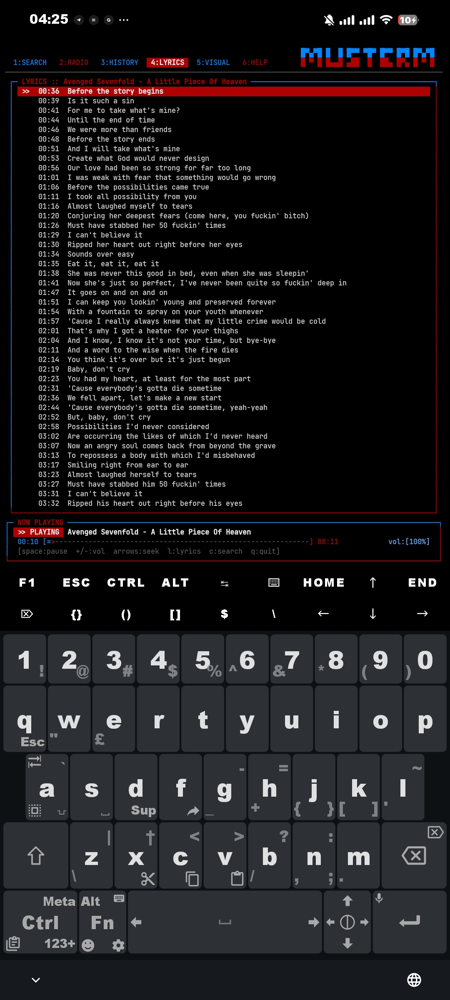
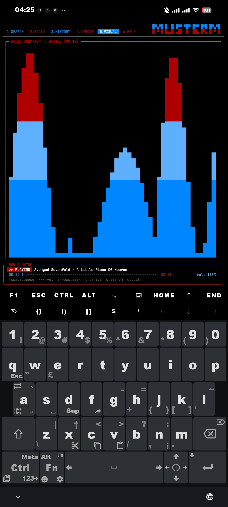
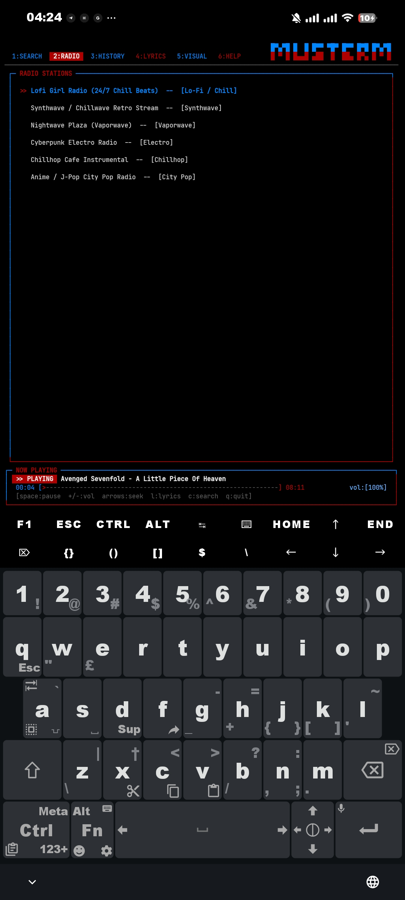
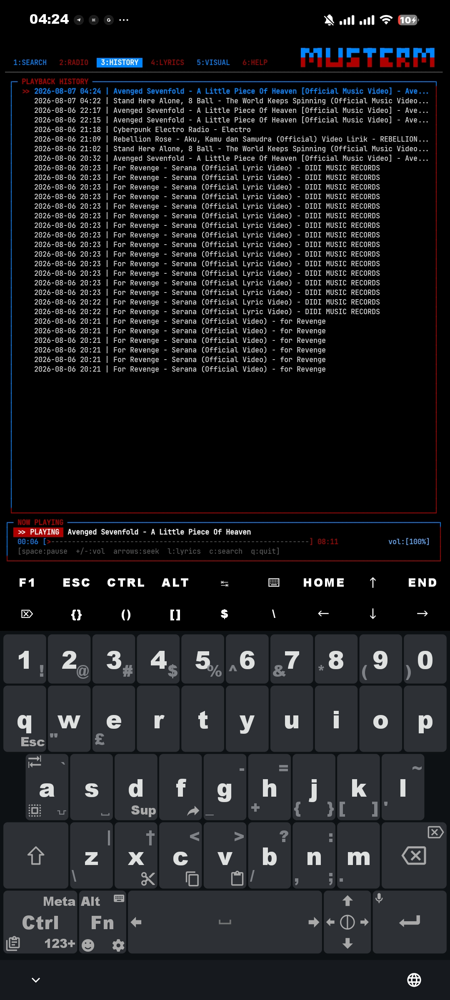
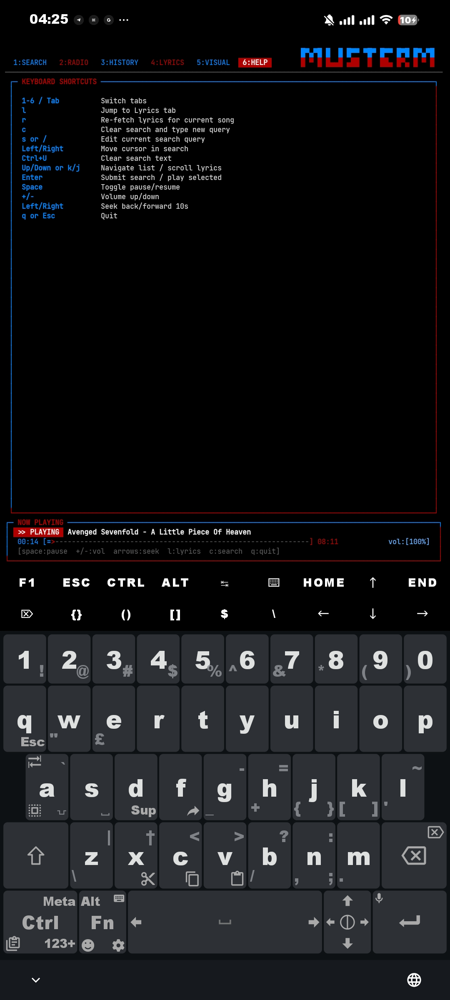

# 🎵 MusTerm - Terminal Music Player & Live Synced Lyrics TUI

**MusTerm** is an ultra-fast, lightweight, and modern terminal music player built with a custom-designed **256-Color TUI (Text User Interface)** featuring a **Live Synced Lyrics Engine (Karaoke Mode)** and dynamic audio spectrum visualizer.

Designed for **Termux (Android)**, **Linux (Debian, Arch, Ubuntu, Fedora, Alpine)**, **macOS**, and **WSL**.

---

> [!NOTE]
> MusTerm is designed as a standalone single-command application (`musterm`). It requires no python third-party library dependencies (pip-free) and runs out of the box using pure Python, `mpv`, and `yt-dlp`.

---

## 📽️ Video Demo & Review

[](data/review.mp4)

> [!TIP]
> Click the badge above or [open data/review.mp4](data/review.mp4) to watch the full video walkthrough.

---

## 📸 Interface Preview & Screenshots

### 🎤 Live Synced Lyrics (Karaoke Mode)


### 🎛️ Dynamic Audio Spectrum Visualizer


### 📻 24/7 Live Radio Streams


### 📜 Playback History Log


### ⚙️ Keyboard Controls & Help Manual


---

## ✨ Features

- 🎤 **Live Synced Lyrics (Karaoke Mode)**: Auto-fetches synchronized LRC lyrics via the LRCLIB database. Displays the current active singing line in glowing Debian Red, auto-scrolls in sync with playback time, and shows live mini lyrics on any tab.
- 📲 **Android Lockscreen & Media Notification**: Native media notification via `termux-notification` with live subtitle lyrics, song progress, play/pause toggling, and track navigation directly from the Android lockscreen or status bar.
- 🎨 **Kali & Debian Hybrid Theme**: Custom-built ANSI 256-Color UI blending Kali Electric Blue borders with Debian Crimson Red accents.
- 🎛️ **Music-Synced Spectrum Visualizer**: Dynamic vertical audio equalizer bars pulsing to the exact tempo and frequency bands of playing audio.
- 📻 **24/7 Live Radio Streams**: Pre-loaded Lo-Fi Girl, Synthwave, Vaporwave, Cyberpunk Electro, and City Pop streams with instant 1-click playback.
- ⚡ **Ultra-Fast Stream Extraction**: Pre-resolves YouTube direct stream URLs via `yt-dlp` in background threads for instant (<1s) playback without player buffering stalls.
- 📜 **Playback History**: Automatic timestamped history log saved to `~/.config/musterm/history.log`.

---

## 🚀 Installation & Usage

### ⚡ 1-Command Auto Installer (Recommended)
Run this single command in your terminal to automatically download, install packages, and link `musterm` directly to your system `$PREFIX/bin` (or `PATH`):

```bash
curl -fsSL https://raw.githubusercontent.com/ihsannyy/musterm/main/install.sh | bash
```

> [!NOTE]
> After running the 1-command installer above, you can immediately type **`musterm`** from **any directory** in your terminal!

---

### 📦 Manual Installation (Git Clone)

#### 📱 For Termux (Android)
```bash
pkg update && pkg install git -y
git clone https://github.com/ihsannyy/musterm.git
cd musterm
./musterm
```

#### 🐧 For Linux (Ubuntu / Debian / Arch / Fedora) & macOS
```bash
git clone https://github.com/ihsannyy/musterm.git
cd musterm
./musterm
```

---

> [!TIP]
> **Global System Command**: On first launch, MusTerm automatically links itself to your system `$PREFIX/bin` or `PATH`. After installation, you can type **`musterm`** from **any directory** in your terminal!

---

### Dependency Repair, PATH Check, & Clear History
```bash
# Clear playback history log
musterm --clear-history

# Remote / Lockscreen control CLI commands
musterm --toggle   # Toggle play/pause on active player
musterm --play     # Resume playback
musterm --pause    # Pause playback
musterm --next     # Next track / seek +15s
musterm --prev     # Previous track / seek -15s
musterm --stop     # Stop playback & clear notification

# Inspect or repair system dependencies (python3, mpv, yt-dlp)
musterm --check
```

---

> [!TIP]
> MusTerm auto-detects your system package manager (`pkg`, `apt`, `brew`, `pacman`, `dnf`, `apk`, `xbps`) and will install missing binaries automatically on first launch!

---

## ⌨️ Keyboard Shortcuts & Navigation

| Category | Key | Action |
| --- | --- | --- |
| **Navigation** | `1` - `6` or `Tab` | Switch Tabs (`Search`, `Radio`, `History`, `Lyrics`, `Visualizer`, `Help`) |
| **History** | `c` or `x` *(in History tab)* | Clear playback history log instantly |
| **Lyrics** | `l` | Jump directly to Live Synced Lyrics tab |
| **Lyrics** | `r` | Re-fetch / Refresh lyrics for currently playing song |
| **Search** | `s` or `/` | Activate Live Search Input Box |
| **Search** | `c` *(in Search tab)* | Clear search query & type new title |
| **Search Mode** | `Tab` / `Esc` / `↓` | Exit search edit mode & return to list navigation |
| **List Scroll** | `↑` / `↓` or `k` / `j` | Navigate tracks & scroll lyrics |
| **Track Skip** | `>` / `n` or `<` / `p` | Play next / previous track or seek 15s |
| **Playback** | `Enter` | Submit Search / Play selected item |
| **Playback** | `Space` | Toggle Pause / Resume |
| **Volume** | `+` / `-` | Increase / Decrease volume |
| **Seeking** | `←` / `→` | Seek backward / forward 10 seconds |
| **App** | `q` or `Esc` | Quit MusTerm TUI Application |

---

## 📁 File Structure

| File | Description |
| --- | --- |
| [musterm.py](musterm.py) | Full Curses TUI Engine, Audio Spectrum Visualizer, & Live Lyrics Fetcher |
| [musterm.sh](musterm.sh) | Universal Shell Launcher & Dependency Auto-Installer |
| [musterm](musterm) | Executable Launcher Symlink |
| [data/](data/) | Screenshots & Video Review Assets |

---

> [!IMPORTANT]
> To ensure seamless playback on Termux Android, ensure PulseAudio is active. MusTerm starts PulseAudio automatically on launch if installed.
